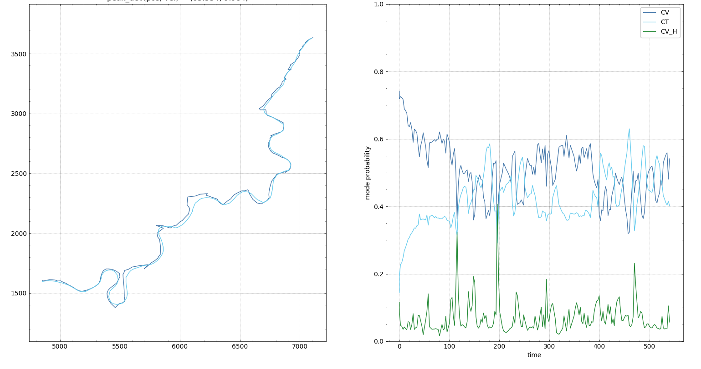
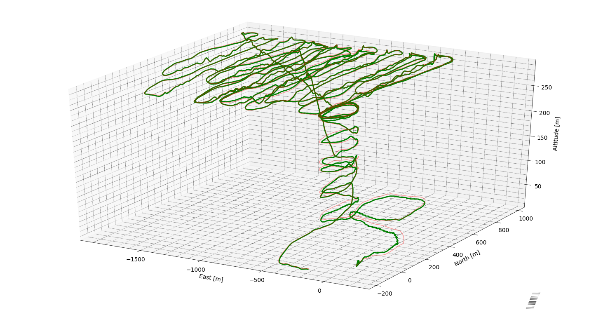
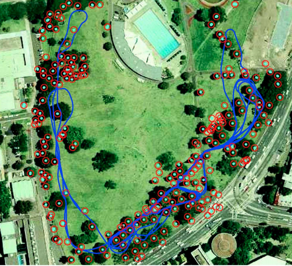
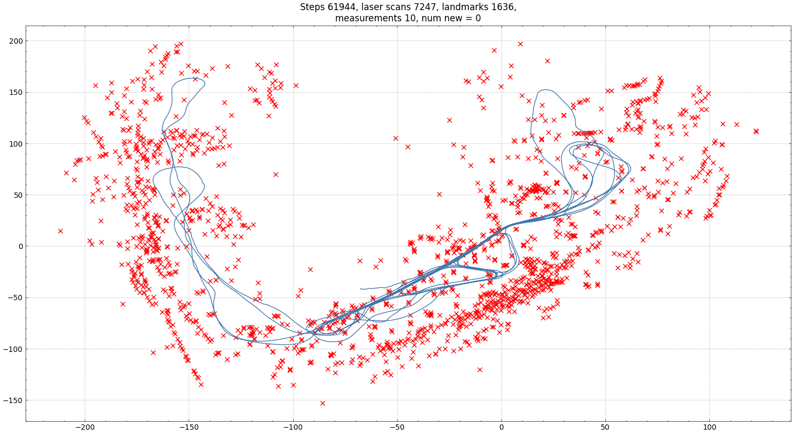

# TTK4250-SensorFusion
Assignments for the coures TTK4250-Sensor Fusion at NTNU 2020. The graded assignments was done together with Leik Lima-Eriksen. The main topics of the assignments target tracking, inertial navigation and SLAM. Together with an exam the assignments part of the grade. 
The reports can be found [here](./reports) 

## Assigment 1: IMM-PDAF
For assignemt 1 an IMM-PDAF was used for target tracking with a simulated dataset and a real dataset with a boat doing fast succesive turns with some clutter and missed detections. The simulated data is relatively easy and was used to test the filter to ensure it was working as intended. 
An IMM-PDAF with a CV-model with low variance, a CV-model with high variance and a CT-model was found to give the best results for the dataset.

*The estimated track an ground truth i plotted to the left, and the mode probabilities is plotted to the right.*

    Score: 14.8/15

## Assignment 2: Inertial Navigation with ESKF
Similarly for assigment 2 a simulated and a real dataset was provided. Using an ESKF the pose and trajectory was estimated. The simulated dataset was again used as proof of concept before tuning the filter for the real dataset where a STIM300 IMU was fitted to a plane.
 

    *The trajectory of the plane.*

    Score: 22.2/30

## Assignment 3: EKF-SLAM
For assignment 3 EKF-SLAM was used to create a map and estimate the pose of a moving car. The EKF-SLAM is not the best SLAM method for this dataset as the dataset is a bit too large making the computaions very timeconsuming. The data association used is also not the best in terms of performance. The shortcomings and possible improvemnts are disscused in the report.

*Aerial photo of the park along with the track*
    

*The estimated track along with the landmarks*

    Score 26.8/30
